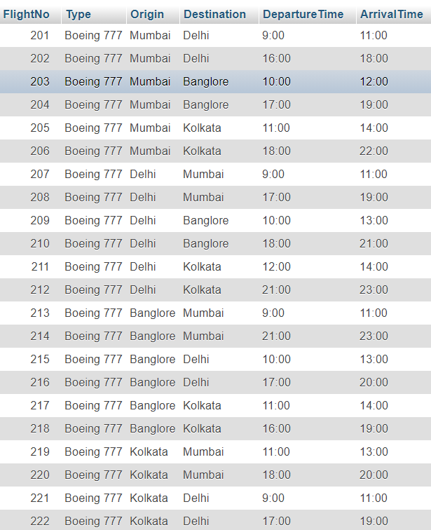
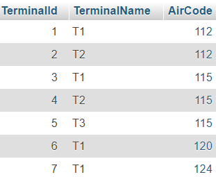

# GDC-Airways-Web-App
HTML, CSS, JavaScript, PHP based web application for Airline ticket management.

# ✈️ GDC Airways Web App - README

Welcome to **GDC-Airways**, a full-featured airline ticket management system developed using HTML, CSS, JavaScript, and PHP. This repository contains everything needed to set up and run a simple but powerful airplane booking platform.

---

## 🖥️ Demo
🎥 [Watch Live Demo](https://youtu.be/4ColvwzCDp0)

---

## 🔧 Installation Guide

Follow these steps to get the project running locally:

1. **Install XAMPP**
2. Open `phpMyAdmin` and create the required database.
3. Import the database tables (schema listed below).
4. **Clone** or **Download** this repository.
5. Create a new folder in `xampp/htdocs/dashboard/`.
6. Paste all the files from this repository into the new folder.
7. Start the Apache and MySQL servers from the XAMPP Control Panel.
8. Visit `http://localhost/dashboard/your_folder_name` in your browser.

---

## 📊 Database Schema

### Tables
* Airport <br/>

* Flight <br/>

* Passenger <br/>

* Terminal <br/>

* ticket <br/>

* Users <br/>

### Database Schema <br/>

---

## ⚙️ Tech Stack

- **Frontend:** HTML, CSS, JavaScript
- **Backend:** PHP
- **Database:** MySQL (via phpMyAdmin)

---

## 📂 File Structure

```
GDC-AIRWAYS-WEB-APP/
├── index.html           # Main landing page
├── book.html            # Booking interface
├── view_flights.php     # Show flight listings
├── add_passenger.php    # Passenger registration
├── styles/              # CSS files
├── scripts/             # JS files
├── db/                  # Database connection logic
└── README.md            # This file
```

---

## 🛠 Features

- View available flights by airport/terminal
- Register passengers
- Book tickets and assign seats
- View all ticket bookings
- User login system for admins/staff

---

## 💡 Future Improvements

- Implement search with filters (date, airport, destination)
- Add payment integration (Razorpay, Stripe)
- Email notifications after ticket booking
- Mobile responsive UI redesign
- Airline Admin Dashboard
- API-based live flight status

---

## 🙋‍♂️ About Me

Hi, I’m **Ankit Bhaumik**, a passionate engineering student working on impactful web-based systems. GDC Airways is part of my journey in mastering full-stack development.

---

## 📬 Contact Me

- GitHub: [github.com/Ankitbhaumik916](https://github.com/Ankitbhaumik916)
- LinkedIn: [linkedin.com/in/yourprofile](#) *(Update this link)*

---

🛫 *Booking simplified, travel elevated — with GDC Airways.*


### Installation
* Install XAMPP
* Create all the database tables from phpMyAdmin
* Clone this repository
* Create a new Folder in xampp/htdocs/dashboard/
* Paste all the files in the new folder
* Run Xampp server
* Ping locahost/dashboard/new_folder_name
